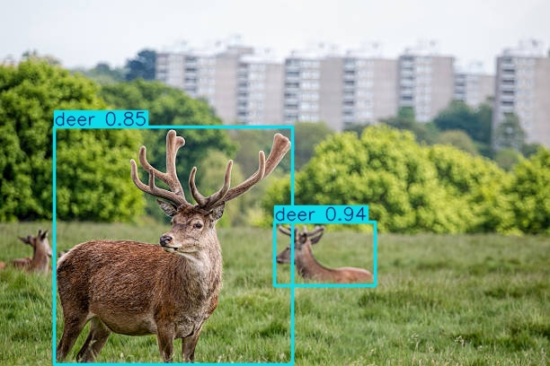
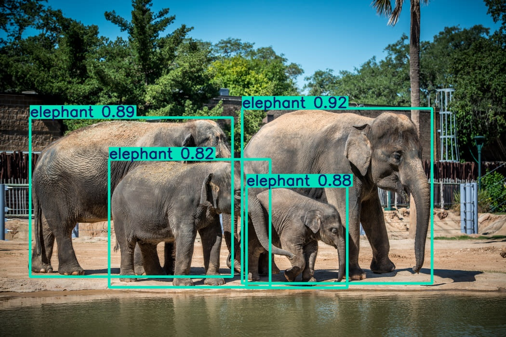
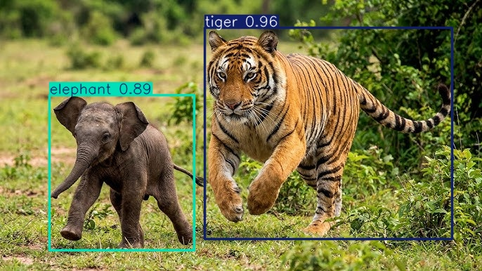
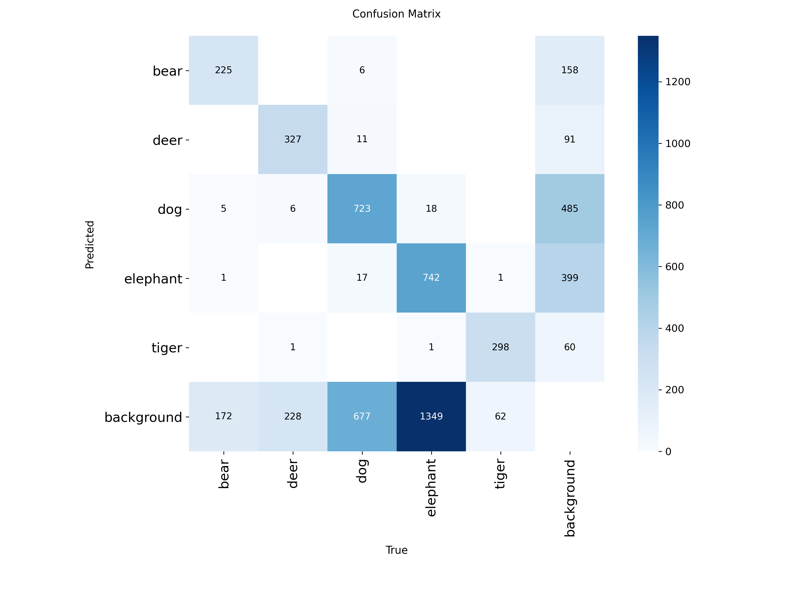
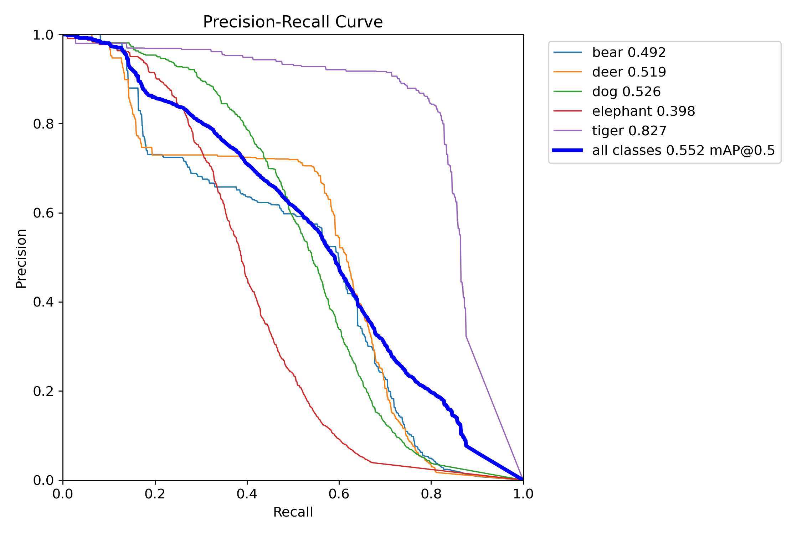
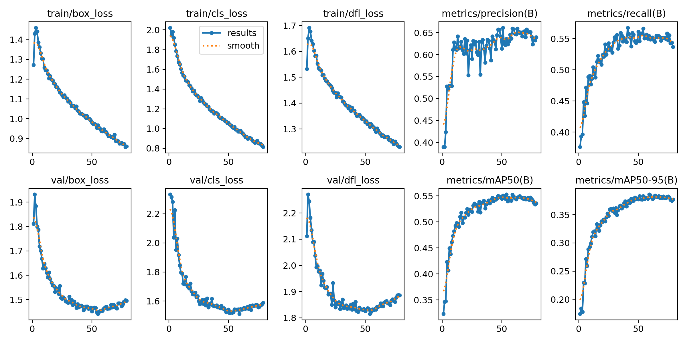

# Real-Time Wildlife Detection using YOLOv8

## Overview

This project implements a real-time wildlife detection system using the YOLOv8 model. It is capable of detecting multiple animal classes including:

* Bear
* Deer
* Dog
* Tiger
* Elephant

The system supports both image and webcam-based detection and demonstrates a complete pipeline from dataset preparation to model inference.

---

## Features

* Real-time object detection using YOLOv8
* Custom-trained model on wildlife dataset
* Supports multiple input sources (image/video/webcam)
* Modular and clean project structure
* Dataset preprocessing and label correction

---

## Tech Stack

* Python
* YOLOv8 (Ultralytics)
* OpenCV
* NumPy

---

## 📂 Project Structure

```bash
real-time-wildlife-detection-yolov8/
│
├── README.md
├── requirements.txt
├── .gitignore
│
├── src/
│   ├── train.py
│   ├── inference.py
│   ├── webcam_test.py
│   └── fix_labels.py
│
├── configs/
│   └── data.yaml
│
├── data/                  # contains sample dataset (full dataset included in google drive link below)
│
├── input/
│   ├── images/
│   └── videos/
│
├── outputs/               
│   ├── images/
│   └── videos/
│
└── scripts/
    └── split_dataset.py
```

---

## Dataset

This project uses a custom dataset containing 5 wildlife classes:
**bear, deer, dog, tiger, elephant**

⚠️ Full dataset is not included due to size limitations.

👉 Download full dataset here:
*https://drive.google.com/file/d/1dRf1TJCpRDk9r1wVF9HN4N0NuCwbtZol/view?usp=sharing*

---

## ▶️ How to Run

### 1️⃣ Install dependencies

```bash
pip install -r requirements.txt
```

### 2️⃣ Train model

```bash
python src/train.py
```

### 3️⃣ Run webcam detection

```bash
python src/webcam_test.py
```

### 4️⃣ Run inference

```bash
python src/inference.py
```

---

## Demo

* Input: Live webcam feed / images/video
    [Click to watch input video](input/videos/wildlife_documentary.mp4)

* Output: Bounding boxes with detected animal labels
    
    
    

    [Click to watch output video](outputs/videos/wildlife_documentary.mp4)

---

## Results





The model successfully detects animals and displays:
- Class name (bear, deer, dog, tiger, elephant)
- Confidence score
- Bounding boxes

Example outputs are available in the `outputs/` folder.

---

## Model Performance

- mAP@50: 0.553
- Precision: 0.659
- Recall: 0.554

The model achieves moderate accuracy due to limited dataset size. Performance can be improved with more training data or using YOLOv8l and hyperparameter tuning.

---

## Future Improvements

* Improve model accuracy with larger dataset
* Deploy as web application (Flask/Streamlit)
* Optimize for edge devices (Raspberry Pi / ESP32 integration)

---

## Author

**Piyush Bhatia**

- GitHub: [Piyush-debug53](https://github.com/Piyush-debug53)  
- LinkedIn: [Piyush Bhatia](https://www.linkedin.com/in/piyush-bhatia-14274a28a/)

---
